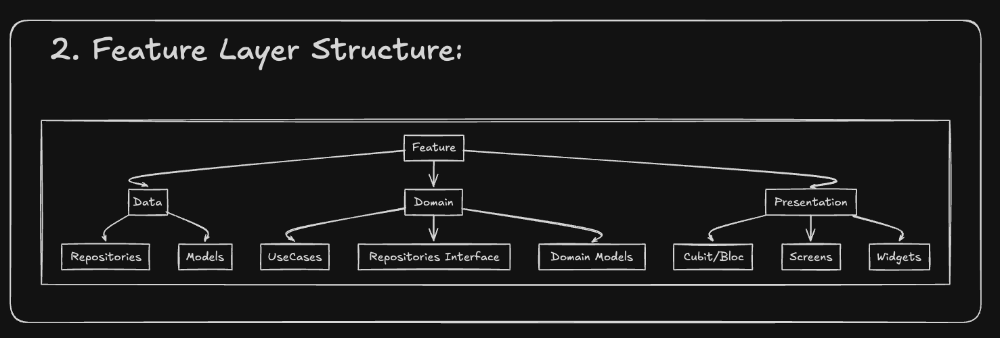
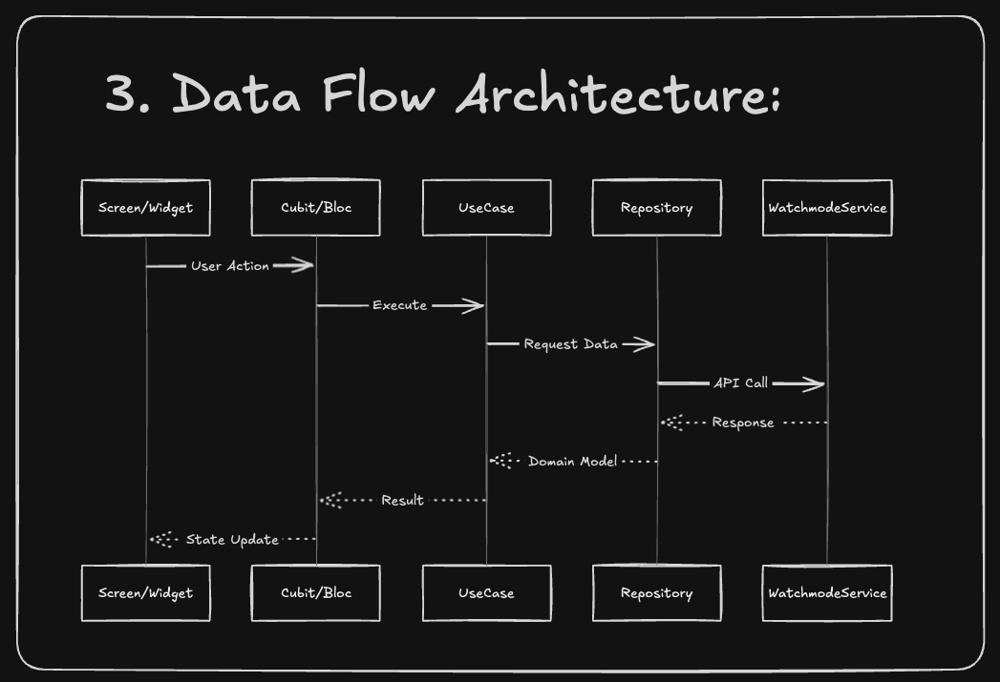
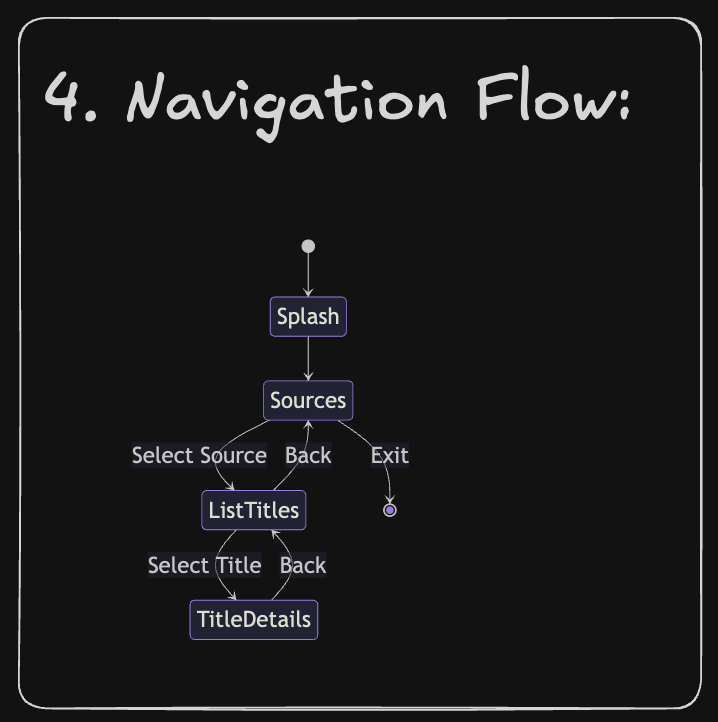
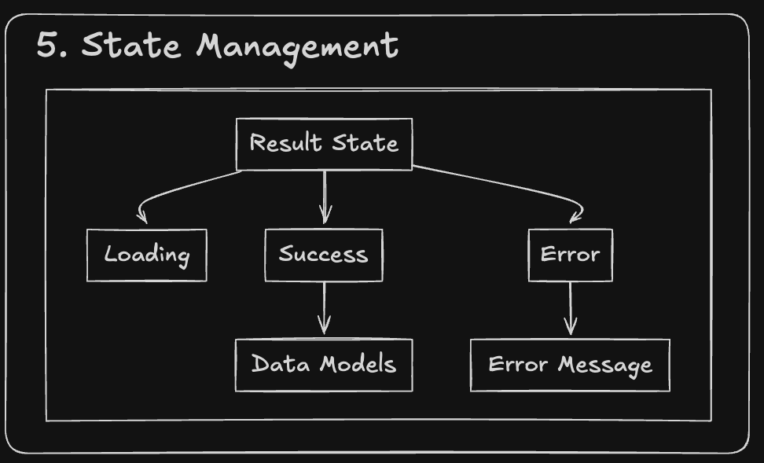

# Movie Browser App Architecture

## 1. Overall Feature Architecture


The application follows a feature-first architecture with clean separation of concerns across multiple layers. The architecture is designed to be scalable, maintainable, and testable.

### Data Flow Layers
- **API Layer**: External data communication interface
- **Repository Layer**: Data operations and caching management
- **UseCase Layer**: Business logic implementation
- **Presentation Layer**: UI and state management

### Core Components
- **Router**: Navigation management using GoRouter
- **Services**: Global application services
- **Utils**: Helper functions and utilities
- **Widgets**: Reusable UI components

### Feature Flow
App Entry → Splash → Sources → List Titles → Title Details

## 2. Feature Layer Structure



Each feature in the application is organized into three main layers:

### Data Layer
- **Repositories**: Data operations handling
- **Models**: Data structure definitions

### Domain Layer
- **UseCases**: Business logic containers
- **Repository Interfaces**: Data contract definitions
- **Domain Models**: Business objects

### Presentation Layer
- **Cubit/Bloc**: State management
- **Screens**: UI components
- **Widgets**: Reusable UI elements

## 3. Data Flow Architecture



The application implements a unidirectional data flow:

1. User actions originate from Screen/Widget
2. Cubit/Bloc processes actions
3. UseCase executes business logic
4. Repository performs data operations
5. WatchmodeService handles API communication
6. Response flows back through layers
7. UI updates based on state changes

## 4. Navigation Flow



The application uses GoRouter for navigation with the following structure:

- **Splash**: Application entry point
- **Sources**: Content source selection
- **ListTitles**: Content browsing
- **TitleDetails**: Detailed content view

### Navigation Actions
- Select Source: Navigate to content list
- Back: Return to previous screen
- Exit: Close application
- Select Title: View content details

## 5. State Management



State handling uses Bloc/Cubit pattern with Provider:

### Result States
- **Loading**: Data fetching state
- **Success**: Successful operation state
  - Contains Data Models
- **Error**: Failed operation state
  - Contains Error Message

## Technology Stack

- **State Management**: Bloc/Cubit with Provider
- **Navigation**: GoRouter
- **Architecture**: Feature-first MVVM
- **Utilities**: leancode_cubit_utils

## Getting Started

### Prerequisites

- Flutter SDK 3.27.3 or higher
- Dart SDK 3.6.1 or higher
- IDE with Flutter support (VS Code, Android Studio, or IntelliJ IDEA)
- Git for version control

### Installation

1. **Clone the repository**
   ```bash
   git clone <repository-url>
   cd watchflix
   ```

2. **Install dependencies**
   ```bash
   flutter pub get
   ```

3. **Configure API Keys**
   - Open `lib/main.dart`
   - Replace `YOUR_API_KEY_HERE` with your Watchmode API key
   - Get your API key from [Watchmode API](https://api.watchmode.com/)

4. **Generate code (if needed)**
   ```bash
   flutter pub run build_runner build --delete-conflicting-outputs
   ```

5. **Run the application**
   ```bash
   # For development
   flutter run

   # For web
   flutter run -d chrome

   # For specific device
   flutter devices
   flutter run -d <device-id>
   ```

### Project Structure

```
lib/
├── core/                    # Core functionality
│   ├── cache/              # Caching utilities
│   ├── error/              # Error handling
│   ├── router/             # Navigation setup
│   ├── services/           # Global services
│   ├── utils/              # Utility functions
│   └── widgets/            # Reusable widgets
├── features/               # Feature modules
│   ├── splash/            # Splash screen
│   ├── sources/           # Content sources
│   ├── list_titles/       # Title browsing
│   └── title_details/     # Title details
│       ├── data/          # Data layer
│       ├── domain/        # Business logic
│       └── presentation/  # UI layer
├── app_config.dart        # App configuration
└── main.dart              # App entry point
```

## Development Guidelines

### Architecture Principles

#### 1. Feature-First Organization
- Organize code by features, not layers
- Each feature contains its own data, domain, and presentation layers
- Promote high cohesion and low coupling between features

#### 2. Clean Architecture Layers
- **Presentation Layer**: Screens, widgets, and state management (Cubit/Bloc)
- **Domain Layer**: Business logic, use cases, and repository interfaces
- **Data Layer**: Repository implementations, API clients, and data models

#### 3. Dependency Flow
```
Presentation → Domain ← Data
```
- Presentation depends on Domain
- Data depends on Domain
- Domain depends on nothing (pure business logic)

### Code Style and Conventions

#### General Dart/Flutter
```dart
// Use const constructors
const Text('Hello World')

// Use trailing commas
Widget build(BuildContext context) {
  return Container(
    child: Text('Example'),
  );
}

// Prefer arrow syntax for simple functions
String get fullName => '$firstName $lastName';

// Use descriptive variable names
final bool isLoading = true;
final bool hasError = false;
```

#### State Management with Bloc

```dart
// Use Cubit for simple state
class CounterCubit extends Cubit<int> {
  CounterCubit() : super(0);

  void increment() => emit(state + 1);
}

// Use Bloc for complex event-driven state
class TodoBloc extends Bloc<TodoEvent, TodoState> {
  TodoBloc() : super(TodoInitial()) {
    on<LoadTodos>(_onLoadTodos);
    on<AddTodo>(_onAddTodo);
  }
}

// Access state in widgets
context.read<CounterCubit>().increment();  // Call methods
context.watch<CounterCubit>();              // Rebuild on changes
```

#### Freezed for Immutability

```dart
@freezed
class TitleState with _$TitleState {
  const factory TitleState.initial() = _Initial;
  const factory TitleState.loading() = _Loading;
  const factory TitleState.loaded(List<Title> titles) = _Loaded;
  const factory TitleState.error(String message) = _Error;
}
```

### Code Generation

Run code generation after modifying annotated classes:

```bash
# Generate code
flutter pub run build_runner build --delete-conflicting-outputs

# Watch for changes
flutter pub run build_runner watch --delete-conflicting-outputs
```

### Error Handling

```dart
// Display errors using SelectableText.rich (NOT SnackBars)
SelectableText.rich(
  TextSpan(
    text: 'Error: $errorMessage',
    style: TextStyle(color: Colors.red),
  ),
)

// Handle errors in Cubit state
@freezed
class DataState with _$DataState {
  const factory DataState.initial() = _Initial;
  const factory DataState.loading() = _Loading;
  const factory DataState.success(Data data) = _Success;
  const factory DataState.error(String message) = _Error;
}
```

### Performance Best Practices

1. **Use const widgets**
   ```dart
   const SizedBox(height: 16)
   const Padding(padding: EdgeInsets.all(8))
   ```

2. **Optimize lists**
   ```dart
   ListView.builder(
     itemCount: items.length,
     itemBuilder: (context, index) => ItemWidget(items[index]),
   )
   ```

3. **Use cached network images**
   ```dart
   Image.network(
     imageUrl,
     errorBuilder: (context, error, stackTrace) => Icon(Icons.error),
   )
   ```

### Testing

```bash
# Run all tests
flutter test

# Run tests with coverage
flutter test --coverage

# Run specific test file
flutter test test/features/splash/splash_test.dart
```

### Commit Conventions

Follow [Conventional Commits](https://www.conventionalcommits.org/):

```
feat: add user authentication
fix: resolve title loading issue
refactor: simplify sources repository
docs: update README with setup instructions
test: add tests for title details cubit
chore: update dependencies
```

### Pull Request Guidelines

1. Create a feature branch from `main`
2. Make atomic commits with clear messages
3. Ensure all tests pass
4. Update documentation if needed
5. Request review from team members

### Debugging

```dart
// Use log instead of print
import 'dart:developer' as dev;

dev.log('User ID: $userId', name: 'UserService');

// Use BlocObserver for state monitoring
class AppBlocObserver extends BlocObserver {
  @override
  void onChange(BlocBase bloc, Change change) {
    super.onChange(bloc, change);
    dev.log('${bloc.runtimeType} $change', name: 'BlocObserver');
  }
}

// In main.dart
Bloc.observer = AppBlocObserver();
```

### Code Quality

1. **Line Length**: Keep lines under 80 characters
2. **Formatting**: Run `flutter format .` before committing
3. **Linting**: Fix all lint warnings with `flutter analyze`
4. **Documentation**: Document complex logic and non-obvious decisions

### Resources

- [Flutter Documentation](https://docs.flutter.dev/)
- [Bloc Library](https://bloclibrary.dev/)
- [Freezed Package](https://pub.dev/packages/freezed)
- [GoRouter Documentation](https://pub.dev/packages/go_router)
- [Effective Dart](https://dart.dev/guides/language/effective-dart)
